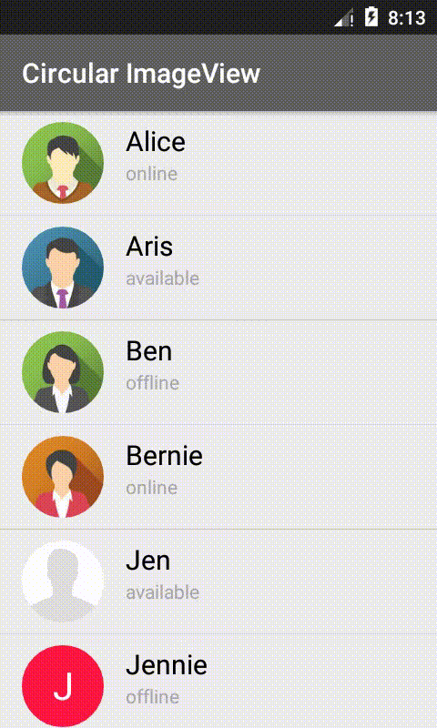
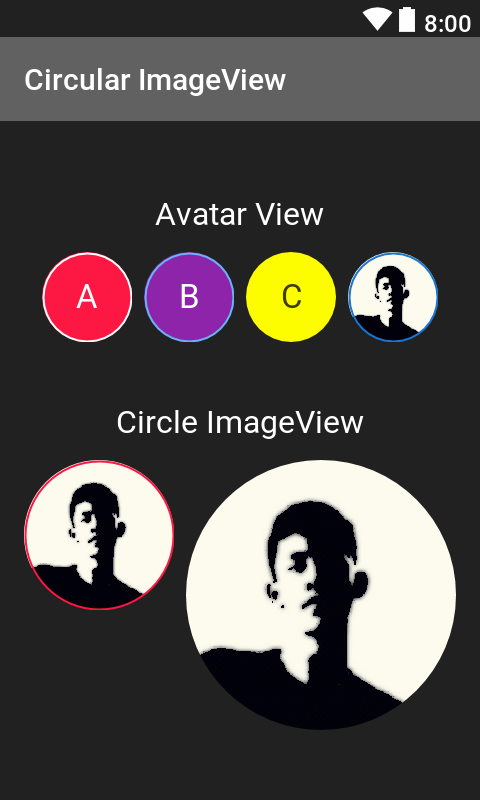
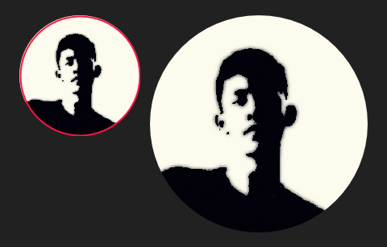

# Android Circular Image View

This library provides you circle and avatar imageview for android. it automatically scale and center a bitmap based on the size of the view but does not copy the bitmap itself.
> this project was inspired by [hdodenhof CircleImageView](https://github.com/hdodenhof/CircleImageView)

## Screenshot

## Setup
- **Step 1** Add repository into root build.gradle

~~~xml
allprojects {
    repositories {
    ...
    maven {
        url 'https://jitpack.io' }
    }
}
~~~

- **Step 2** Add library dependency into app build.gradle

~~~xml
dependencies {
    compile 'com.github.abdularis:CircularImageView:v1.0'
}
~~~

## Usage
Check also the sample app

- Creating circle image view

~~~xml
<com.github.abdularis.civ.CircleImageView
            android:layout_width="100dp"
            android:layout_height="100dp"
            android:layout_marginRight="8dp"
            android:src="@drawable/figure"
            app:strokeColor="@color/colorAccent"
            app:strokeWidth="2px"/>

<com.github.abdularis.civ.CircleImageView
            android:layout_width="180dp"
            android:layout_height="180dp"
            android:src="@drawable/figure"
            app:strokeColor="@color/colorAccent"/>
~~~

- Creating avatar

You can choose either for avatar_state, IMAGE or INITIAL to show the first letter (default is INITIAL)

~~~xml
<com.github.abdularis.civ.AvatarImageView
            android:layout_width="60dp"
            android:layout_height="60dp"
            android:layout_marginLeft="8dp"
            android:src="@drawable/figure"
            app:avatar_state="IMAGE"
            app:avatar_backgroundColor="#1976D2"
            app:avatar_text="B"
            app:avatar_textSize="22sp"
            app:strokeColor="#1976D2"
            app:strokeWidth="1dp"/>
~~~

## XML Attributes
~~~xml
<?xml version="1.0" encoding="utf-8"?>
<resources>
    <declare-styleable name="CircleImageView">
        <attr name="strokeColor" format="color"/>
        <attr name="strokeWidth" format="dimension"/>
    </declare-styleable>

    <declare-styleable name="AvatarImageView">
        <attr name="avatar_backgroundColor" format="color"/>
        <attr name="avatar_textSize" format="dimension"/>
        <attr name="avatar_textColor" format="color"/>
        <attr name="avatar_text" format="string"/>
        <attr name="avatar_state" format="enum">
            <enum name="INITIAL" value="1"/>
            <enum name="IMAGE" value="2"/>
        </attr>
    </declare-styleable>
</resources>
~~~